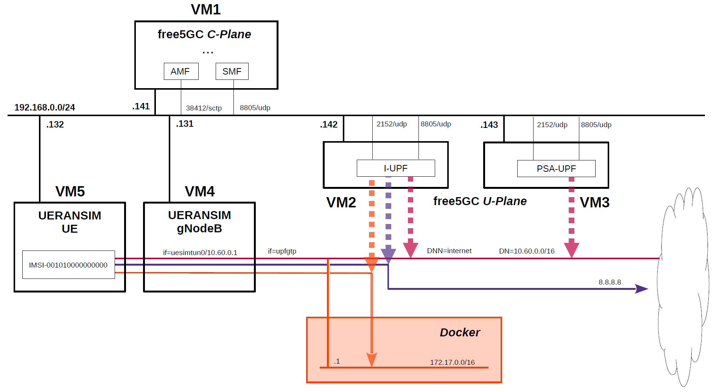

# free5GC 5GC & UERANSIM UE / RAN Sample Configuration - ULCL(Uplink Classifier)
This describes a very simple configuration that uses free5GC and UERANSIM for ULCL(Uplink Classifier).

---

<h2 id="toc">Table of Contents</h2>

- [Overview of free5GC 5GC Simulation Mobile Network](#overview)
- [Changes in configuration files of free5GC 5GC and UERANSIM UE / RAN](#changes)
  - [Changes in configuration files of free5GC 5GC C-Plane](#changes_cp)
  - [Changes in configuration files of free5GC 5GC U-Plane (I-UPF)](#changes_up1)
  - [Changes in configuration files of free5GC 5GC U-Plane (PSA-UPF)](#changes_up2)
  - [Changes in configuration files of UERANSIM UE / RAN](#changes_ueransim)
    - [Changes in configuration files of RAN (gNodeB)](#changes_ran)
    - [Changes in configuration files of UE](#changes_ue)
- [Network settings of free5GC 5GC and UERANSIM UE / RAN](#network_settings)
  - [Network settings of free5GC 5GC U-Plane (I-UPF)](#network_settings_up1)
  - [Network settings of free5GC 5GC U-Plane (PSA-UPF)](#network_settings_up2)
- [Build free5GC and UERANSIM](#build)
- [Run free5GC 5GC and UERANSIM UE / RAN](#run)
  - [Run free5GC 5GC U-Plane (I-UPF & PSA-UPF)](#run_up)
  - [Run free5GC 5GC C-Plane](#run_cp)
  - [Run UERANSIM (gNodeB)](#run_ran)
  - [Run UERANSIM (UE)](#run_ue)
    - [Start UE connected to gNodeB](#con_ue)
    - [Ping google.com going through PSA-UPF](#ping_google)
    - [Ping 8.8.8.8 going through I-UPF](#ping_8)
    - [Ping 172.17.0.1 going through I-UPF](#ping_docker)
- [Changelog (summary)](#changelog)

---
<h2 id="overview">Overview of free5GC 5GC Simulation Mobile Network</h2>

The following minimum configuration was set as a condition.
- I-UPF selects the communication paths according to the destination host and network.

The built simulation environment is as follows.
**In this configuration, I-UPF(VM2) must be reachable to Docker network on local.**

</img>

The 5GC / UE / RAN used are as follows.
- 5GC - free5GC v3.2.1 - https://github.com/free5gc/free5gc
- UE / RAN - UERANSIM v3.2.6 - https://github.com/aligungr/UERANSIM

Each VMs are as follows.  
| VM # | SW & Role | IP address | OS | Memory (Min) | HDD (Min) |
| --- | --- | --- | --- | --- | --- |
| VM1 | free5GC  5GC C-Plane | 192.168.0.141/24 | Ubuntu 20.04 | 2GB | 20GB |
| VM2 | free5GC  5GC U-Plane (I-UPF) | 192.168.0.142/24 | Ubuntu 20.04 | 1GB | 20GB |
| VM3 | free5GC  5GC U-Plane (PSA-UPF) | 192.168.0.143/24 | Ubuntu 20.04 | 1GB | 20GB |
| VM4 | UERANSIM RAN (gNodeB) | 192.168.0.131/24 | Ubuntu 20.04 | 1GB | 10GB |
| VM5 | UERANSIM UE | 192.168.0.132/24 | Ubuntu 20.04 | 1GB | 10GB |

Subscriber Information (other information is default) is as follows.  
**Note. Please select OP or OPc according to the setting of UERANSIM UE configuration files.**
| UE | IMSI | DNN | OP/OPc |
| --- | --- | --- | --- |
| UE | 001010000000000 | internet | OPc |

I registered these information with the free5GC WebUI.
In addition, [3GPP TS 35.208](https://www.3gpp.org/DynaReport/35208.htm) "4.3 Test Sets" is published by 3GPP as test data for the 3GPP authentication and key generation functions (MILENAGE).

DN is as follows.
| DN | TUNnel interface of DN | DNN | TUNnel interface of UE |
| --- | --- | --- | --- |
| 10.60.0.0/16 | upfgtp | internet | uesimtun0 |

The UE routing topology is as follows.
- **UE** -- **gNodeB** -- **I-UPF** -- **PSA-UPF**

The communication paths to be confirmed for each destination IP address are as follows.
| Destination IP address | Communication path |
| --- | --- |
| google.com | PSA-UPF --> Internet |
| 8.8.8.8 | I-UPF --> Internet |
| 172.17.0.1 | I-UPF --> 172.17.0.0/16 (Docker network on local) |

<h2 id="changes">Changes in configuration files of free5GC 5GC and UERANSIM UE / RAN</h2>

Please refer to the following for building free5GC and UERANSIM respectively.
- free5GC v3.2.1 - https://github.com/free5gc/free5gc/wiki/Installation
- UERANSIM v3.2.6 - https://github.com/aligungr/UERANSIM/wiki/Installation

<h3 id="changes_cp">Changes in configuration files of free5GC 5GC C-Plane</h3>

- `free5gc/config/amfcfg.yaml`
```diff
--- amfcfg.yaml.orig    2022-04-01 20:25:54.000000000 +0900
+++ amfcfg.yaml 2022-08-16 19:06:54.707038398 +0900
@@ -5,7 +5,7 @@
 configuration:
   amfName: AMF # the name of this AMF
   ngapIpList:  # the IP list of N2 interfaces on this AMF
-    - 127.0.0.18
+    - 192.168.0.141
   sbi: # Service-based interface information
     scheme: http # the protocol for sbi (http or https)
     registerIPv4: 127.0.0.18 # IP used to register to NRF
@@ -23,18 +23,18 @@
   servedGuamiList: # Guami (Globally Unique AMF ID) list supported by this AMF
     # <GUAMI> = <MCC><MNC><AMF ID>
     - plmnId: # Public Land Mobile Network ID, <PLMN ID> = <MCC><MNC>
-        mcc: 208 # Mobile Country Code (3 digits string, digit: 0~9)
-        mnc: 93 # Mobile Network Code (2 or 3 digits string, digit: 0~9)
+        mcc: 001 # Mobile Country Code (3 digits string, digit: 0~9)
+        mnc: 01 # Mobile Network Code (2 or 3 digits string, digit: 0~9)
       amfId: cafe00 # AMF identifier (3 bytes hex string, range: 000000~FFFFFF)
   supportTaiList:  # the TAI (Tracking Area Identifier) list supported by this AMF
     - plmnId: # Public Land Mobile Network ID, <PLMN ID> = <MCC><MNC>
-        mcc: 208 # Mobile Country Code (3 digits string, digit: 0~9)
-        mnc: 93 # Mobile Network Code (2 or 3 digits string, digit: 0~9)
+        mcc: 001 # Mobile Country Code (3 digits string, digit: 0~9)
+        mnc: 01 # Mobile Network Code (2 or 3 digits string, digit: 0~9)
       tac: 1 # Tracking Area Code (uinteger, range: 0~16777215)
   plmnSupportList: # the PLMNs (Public land mobile network) list supported by this AMF
     - plmnId: # Public Land Mobile Network ID, <PLMN ID> = <MCC><MNC>
-        mcc: 208 # Mobile Country Code (3 digits string, digit: 0~9)
-        mnc: 93 # Mobile Network Code (2 or 3 digits string, digit: 0~9)
+        mcc: 001 # Mobile Country Code (3 digits string, digit: 0~9)
+        mnc: 01 # Mobile Network Code (2 or 3 digits string, digit: 0~9)
       snssaiList: # the S-NSSAI (Single Network Slice Selection Assistance Information) list supported by this AMF
         - sst: 1 # Slice/Service Type (uinteger, range: 0~255)
           sd: 010203 # Slice Differentiator (3 bytes hex string, range: 000000~FFFFFF)
```
- `free5gc/config/smfcfg.yaml`
```diff
--- smfcfg.yaml.orig    2022-04-01 20:25:54.000000000 +0900
+++ smfcfg.yaml 2022-08-16 19:08:39.003874183 +0900
@@ -32,42 +32,56 @@
           dns: # the IP address of DNS
             ipv4: 8.8.8.8
   plmnList: # the list of PLMN IDs that this SMF belongs to (optional, remove this key when unnecessary)
-    - mcc: "208" # Mobile Country Code (3 digits string, digit: 0~9)
-      mnc: "93" # Mobile Network Code (2 or 3 digits string, digit: 0~9)
+    - mcc: "001" # Mobile Country Code (3 digits string, digit: 0~9)
+      mnc: "01" # Mobile Network Code (2 or 3 digits string, digit: 0~9)
   locality: area1 # Name of the location where a set of AMF, SMF and UPFs are located
   pfcp: # the IP address of N4 interface on this SMF (PFCP)
-    addr: 127.0.0.1
+    addr: 192.168.0.141
   userplaneInformation: # list of userplane information
     upNodes: # information of userplane node (AN or UPF)
       gNB1: # the name of the node
         type: AN # the type of the node (AN or UPF)
-      UPF:  # the name of the node
+      I-UPF:  # the name of the node
         type: UPF # the type of the node (AN or UPF)
-        nodeID: 127.0.0.8 # the IP/FQDN of N4 interface on this UPF (PFCP)
+        nodeID: 192.168.0.142 # the IP/FQDN of N4 interface on this UPF (PFCP)
         sNssaiUpfInfos: # S-NSSAI information list for this UPF
           - sNssai: # S-NSSAI (Single Network Slice Selection Assistance Information)
               sst: 1 # Slice/Service Type (uinteger, range: 0~255)
               sd: 010203 # Slice Differentiator (3 bytes hex string, range: 000000~FFFFFF)
             dnnUpfInfoList: # DNN information list for this S-NSSAI
               - dnn: internet
-                pools:
-                  - cidr: 10.60.0.0/16
+        interfaces: # Interface list for this UPF
+          - interfaceType: N3 # the type of the interface (N3 or N9)
+            endpoints: # the IP address of this N3/N9 interface on this UPF
+              - 192.168.0.142
+            networkInstance: internet # Data Network Name (DNN)
+          - interfaceType: N9 # the type of the interface (N3 or N9)
+            endpoints: # the IP address of this N3/N9 interface on this UPF
+              - 192.168.0.142
+            networkInstance: internet # Data Network Name (DNN)
+      PSA-UPF:  # the name of the node
+        type: UPF # the type of the node (AN or UPF)
+        nodeID: 192.168.0.143 # the IP/FQDN of N4 interface on this UPF (PFCP)
+        sNssaiUpfInfos: # S-NSSAI information list for this UPF
           - sNssai: # S-NSSAI (Single Network Slice Selection Assistance Information)
               sst: 1 # Slice/Service Type (uinteger, range: 0~255)
-              sd: 112233 # Slice Differentiator (3 bytes hex string, range: 000000~FFFFFF)
+              sd: 010203 # Slice Differentiator (3 bytes hex string, range: 000000~FFFFFF)
             dnnUpfInfoList: # DNN information list for this S-NSSAI
               - dnn: internet
                 pools:
-                  - cidr: 10.61.0.0/16
+                  - cidr: 10.60.0.0/16
         interfaces: # Interface list for this UPF
-          - interfaceType: N3 # the type of the interface (N3 or N9)
+          - interfaceType: N9 # the type of the interface (N3 or N9)
             endpoints: # the IP address of this N3/N9 interface on this UPF
-              - 127.0.0.8
+              - 192.168.0.143
             networkInstance: internet # Data Network Name (DNN)
     links: # the topology graph of userplane, A and B represent the two nodes of each link
       - A: gNB1
-        B: UPF
+        B: I-UPF
+      - A: I-UPF
+        B: PSA-UPF
   nrfUri: http://127.0.0.10:8000 # a valid URI of NRF
+  ulcl: true
 
 # the kind of log output
 # debugLevel: how detailed to output, value: trace, debug, info, warn, error, fatal, panic
```
- `free5gc/config/ausfcfg.yaml`
```diff
--- ausfcfg.yaml.orig   2022-04-01 20:25:54.000000000 +0900
+++ ausfcfg.yaml        2022-08-12 18:08:52.000000000 +0900
@@ -15,10 +15,8 @@
     - nausf-auth # Nausf_UEAuthentication service
   nrfUri: http://127.0.0.10:8000 # a valid URI of NRF
   plmnSupportList: # the PLMNs (Public Land Mobile Network) list supported by this AUSF
-    - mcc: 208 # Mobile Country Code (3 digits string, digit: 0~9)
-      mnc: 93  # Mobile Network Code (2 or 3 digits string, digit: 0~9)
-    - mcc: 123 # Mobile Country Code (3 digits string, digit: 0~9)
-      mnc: 45  # Mobile Network Code (2 or 3 digits string, digit: 0~9)
+    - mcc: 001 # Mobile Country Code (3 digits string, digit: 0~9)
+      mnc: 01  # Mobile Network Code (2 or 3 digits string, digit: 0~9)
   groupId: ausfGroup001 # ID for the group of the AUSF
   eapAkaSupiImsiPrefix: false # including "imsi-" prefix or not when using the SUPI to do EAP-AKA' authentication
 
```
- `free5gc/config/nrfcfg.yaml`
```diff
--- nrfcfg.yaml.orig    2022-04-01 20:25:54.000000000 +0900
+++ nrfcfg.yaml 2022-04-03 21:57:18.000000000 +0900
@@ -14,8 +14,8 @@
       pem: config/TLS/nrf.pem # NRF TLS Certificate
       key: config/TLS/nrf.key # NRF TLS Private key
   DefaultPlmnId:
-    mcc: 208 # Mobile Country Code (3 digits string, digit: 0~9)
-    mnc: 93 # Mobile Network Code (2 or 3 digits string, digit: 0~9)
+    mcc: 001 # Mobile Country Code (3 digits string, digit: 0~9)
+    mnc: 01 # Mobile Network Code (2 or 3 digits string, digit: 0~9)
   serviceNameList: # the SBI services provided by this NRF, refer to TS 29.510
     - nnrf-nfm # Nnrf_NFManagement service
     - nnrf-disc # Nnrf_NFDiscovery service
```
- `free5gc/config/nssfcfg.yaml`
```diff
--- nssfcfg.yaml.orig   2022-04-01 20:25:54.000000000 +0900
+++ nssfcfg.yaml        2022-08-16 19:07:55.035859909 +0900
@@ -17,12 +17,12 @@
     - nnssf-nssaiavailability # Nnssf_NSSAIAvailability service
   nrfUri: http://127.0.0.10:8000 # a valid URI of NRF
   supportedPlmnList: # the PLMNs (Public land mobile network) list supported by this NSSF
-    - mcc: 208 # Mobile Country Code (3 digits string, digit: 0~9)
-      mnc: 93 # Mobile Network Code (2 or 3 digits string, digit: 0~9)
+    - mcc: 001 # Mobile Country Code (3 digits string, digit: 0~9)
+      mnc: 01 # Mobile Network Code (2 or 3 digits string, digit: 0~9)
   supportedNssaiInPlmnList: # Supported S-NSSAI List for each PLMN
     - plmnId: # Public Land Mobile Network ID, <PLMN ID> = <MCC><MNC>
-        mcc: 208 # Mobile Country Code (3 digits string, digit: 0~9)
-        mnc: 93 # Mobile Network Code (2 or 3 digits string, digit: 0~9)
+        mcc: 001 # Mobile Country Code (3 digits string, digit: 0~9)
+        mnc: 01 # Mobile Network Code (2 or 3 digits string, digit: 0~9)
       supportedSnssaiList: # Supported S-NSSAIs of the PLMN
         - sst: 1 # Slice/Service Type (uinteger, range: 0~255)
           sd: 010203 # Slice Differentiator (3 bytes hex string, range: 000000~FFFFFF)
```
- `free5gc/config/uerouting.yaml`
```yaml
info:
  version: 1.0.1
  description: Routing information for UE

ueRoutingInfo: # the list of UE routing information
  UE1: # Group Name
    members:
    - imsi-001010000000000 # Subscription Permanent Identifier of the UE
    topology: # Network topology for this group (Uplink: A->B, Downlink: B->A)
    # default path derived from this topology
    # node name should be consistent with smfcfg.yaml
      - A: gNB1
        B: I-UPF
      - A: I-UPF
        B: PSA-UPF
    specificPath:
      - dest: 8.8.8.8/32 # the destination IP address on Data Network (DN)
        # the order of UPF nodes in this path. We use the UPF's name to represent each UPF node.
        # The UPF's name should be consistent with smfcfg.yaml
        path: [I-UPF]
      - dest: 172.17.0.0/16
        path: [I-UPF]
```

<h3 id="changes_up1">Changes in configuration files of free5GC 5GC U-Plane (I-UPF)</h3>

- `free5gc/config/upfcfg.yaml`
```diff
--- upfcfg.yaml.orig    2022-08-11 14:42:32.000000000 +0900
+++ upfcfg.yaml 2022-08-15 21:56:44.000000000 +0900
@@ -3,8 +3,8 @@
 
 # The listen IP and nodeID of the N4 interface on this UPF (Can't set to 0.0.0.0)
 pfcp:
-  addr: 127.0.0.8   # IP addr for listening
-  nodeID: 127.0.0.8 # External IP or FQDN can be reached
+  addr: 192.168.0.142   # IP addr for listening
+  nodeID: 192.168.0.142 # External IP or FQDN can be reached
   retransTimeout: 1s # retransmission timeout
   maxRetrans: 3 # the max number of retransmission
 
@@ -13,15 +13,17 @@
   # The IP list of the N3/N9 interfaces on this UPF
   # If there are multiple connection, set addr to 0.0.0.0 or list all the addresses
   ifList:
-    - addr: 127.0.0.8
+    - addr: 192.168.0.142
       type: N3
       # name: upf.5gc.nctu.me
       # ifname: gtpif
+    - addr: 192.168.0.142
+      type: N9
 
 # The DNN list supported by UPF
 dnnList:
   - dnn: internet # Data Network Name
-    cidr: 10.60.0.0/24 # Classless Inter-Domain Routing for assigned IPv4 pool of UE
+    cidr: 10.60.0.0/16 # Classless Inter-Domain Routing for assigned IPv4 pool of UE
     # natifname: eth0
 
 logger: # log output setting
```

<h3 id="changes_up2">Changes in configuration files of free5GC 5GC U-Plane (PSA-UPF)</h3>

- `free5gc/config/upfcfg.yaml`
```diff
--- upfcfg.yaml.orig    2022-08-11 14:44:10.000000000 +0900
+++ upfcfg.yaml 2022-08-15 21:57:04.000000000 +0900
@@ -3,8 +3,8 @@
 
 # The listen IP and nodeID of the N4 interface on this UPF (Can't set to 0.0.0.0)
 pfcp:
-  addr: 127.0.0.8   # IP addr for listening
-  nodeID: 127.0.0.8 # External IP or FQDN can be reached
+  addr: 192.168.0.143   # IP addr for listening
+  nodeID: 192.168.0.143 # External IP or FQDN can be reached
   retransTimeout: 1s # retransmission timeout
   maxRetrans: 3 # the max number of retransmission
 
@@ -13,15 +13,15 @@
   # The IP list of the N3/N9 interfaces on this UPF
   # If there are multiple connection, set addr to 0.0.0.0 or list all the addresses
   ifList:
-    - addr: 127.0.0.8
-      type: N3
+    - addr: 192.168.0.143
+      type: N9
       # name: upf.5gc.nctu.me
       # ifname: gtpif
 
 # The DNN list supported by UPF
 dnnList:
   - dnn: internet # Data Network Name
-    cidr: 10.60.0.0/24 # Classless Inter-Domain Routing for assigned IPv4 pool of UE
+    cidr: 10.60.0.0/16 # Classless Inter-Domain Routing for assigned IPv4 pool of UE
     # natifname: eth0
 
 logger: # log output setting
```

<h3 id="changes_ueransim">Changes in configuration files of UERANSIM UE / RAN</h3>

<h4 id="changes_ran">Changes in configuration files of RAN (gNodeB)</h4>

- `UERANSIM/config/free5gc-gnb.yaml`
```diff
--- free5gc-gnb.yaml.orig       2021-02-11 11:03:28.000000000 +0900
+++ free5gc-gnb.yaml    2022-08-16 19:19:11.333695413 +0900
@@ -1,17 +1,17 @@
-mcc: '208'          # Mobile Country Code value
-mnc: '93'           # Mobile Network Code value (2 or 3 digits)
+mcc: '001'          # Mobile Country Code value
+mnc: '01'           # Mobile Network Code value (2 or 3 digits)
 
 nci: '0x000000010'  # NR Cell Identity (36-bit)
 idLength: 32        # NR gNB ID length in bits [22...32]
 tac: 1              # Tracking Area Code
 
-linkIp: 127.0.0.1   # gNB's local IP address for Radio Link Simulation (Usually same with local IP)
-ngapIp: 127.0.0.1   # gNB's local IP address for N2 Interface (Usually same with local IP)
-gtpIp: 127.0.0.1    # gNB's local IP address for N3 Interface (Usually same with local IP)
+linkIp: 192.168.0.131   # gNB's local IP address for Radio Link Simulation (Usually same with local IP)
+ngapIp: 192.168.0.131   # gNB's local IP address for N2 Interface (Usually same with local IP)
+gtpIp: 192.168.0.131    # gNB's local IP address for N3 Interface (Usually same with local IP)
 
 # List of AMF address information
 amfConfigs:
-  - address: 127.0.0.1
+  - address: 192.168.0.141
     port: 38412
 
 # List of supported S-NSSAIs by this gNB
```

<h4 id="changes_ue">Changes in configuration files of UE</h4>

- `UERANSIM/config/free5gc-ue.yaml`
```diff
--- free5gc-ue.yaml.orig        2021-09-18 21:11:52.000000000 +0900
+++ free5gc-ue.yaml     2022-08-16 19:20:18.624943349 +0900
@@ -1,9 +1,9 @@
 # IMSI number of the UE. IMSI = [MCC|MNC|MSISDN] (In total 15 digits)
-supi: 'imsi-208930000000003'
+supi: 'imsi-001010000000000'
 # Mobile Country Code value of HPLMN
-mcc: '208'
+mcc: '001'
 # Mobile Network Code value of HPLMN (2 or 3 digits)
-mnc: '93'
+mnc: '01'
 
 # Permanent subscription key
 key: '8baf473f2f8fd09487cccbd7097c6862'
@@ -20,7 +20,7 @@
 
 # List of gNB IP addresses for Radio Link Simulation
 gnbSearchList:
-  - 127.0.0.1
+  - 192.168.0.131
 
 # UAC Access Identities Configuration
 uacAic:
```

<h2 id="network_settings">Network settings of free5GC 5GC and UERANSIM UE / RAN</h2>

<h3 id="network_settings_up1">Network settings of free5GC 5GC U-Plane (I-UPF)</h3>

First, uncomment the next line in the `/etc/sysctl.conf` file and reflect it in the OS.
```
net.ipv4.ip_forward=1
```
```
# sysctl -p
```
Next, configure NAPT.
```
# iptables -t nat -A POSTROUTING -s 10.60.0.0/16 ! -o upfgtp -j MASQUERADE
```

<h3 id="network_settings_up2">Network settings of free5GC 5GC U-Plane (PSA-UPF)</h3>

First, uncomment the next line in the `/etc/sysctl.conf` file and reflect it in the OS.
```
net.ipv4.ip_forward=1
```
```
# sysctl -p
```
Next, configure NAPT.
```
# iptables -t nat -A POSTROUTING -s 10.60.0.0/16 ! -o upfgtp -j MASQUERADE
```

<h2 id="build">Build free5GC and UERANSIM</h2>

Please refer to the following for building free5GC and UERANSIM respectively.
- free5GC v3.2.1 - https://github.com/free5gc/free5gc/wiki/Installation
- UERANSIM v3.2.6 - https://github.com/aligungr/UERANSIM/wiki/Installation

Note. Install MongoDB with package manager on free5GC 5GC C-Plane machine.
[MongoDB Compass](https://www.mongodb.com/products/compass) is a convenient tool to look at the MongoDB database.
```
# apt update
# apt install mongodb
# systemctl start mongodb
# systemctl enable mongodb
```
It is not necessary to install MongoDB on free5GC 5GC U-Plane machines.

**Note. If you want to use the latest committed version, please run the following script to checkout all NFs and Web Console to the latest `main` branch before building.**
```
#!/usr/bin/env bash

NF_LIST="nrf amf smf udr pcf udm nssf ausf upf n3iwf"

for NF in ${NF_LIST}; do
    cd NFs/${NF}
    git checkout main
    cd ../..
done

cd webconsole
git checkout main

cd ..
git checkout main
```

<h2 id="run">Run free5GC 5GC and UERANSIM UE / RAN</h2>

First run the 5GC, then UERANSIM (UE & RAN implementation).

<h3 id="run_up">Run free5GC 5GC U-Plane (I-UPF & PSA-UPF)</h3>

First, run free5GC 5GC U-Planes. Please see [here](https://github.com/free5gc/free5gc/issues/170#issuecomment-773214169) for the reason.

- free5GC 5GC U-Plane (I-UPF)
```
# cd free5gc
# bin/upf
```
- free5GC 5GC U-Plane (PSA-UPF)
```
# cd free5gc
# bin/upf
```
Then run `tcpdump` on one more terminals for U-Plane.
- Run `tcpdump` on VM2 (U-Plane (I-UPF))
```
# tcpdump -i upfgtp -n
tcpdump: verbose output suppressed, use -v or -vv for full protocol decode
listening on upfgtp, link-type RAW (Raw IP), capture size 262144 bytes
```
- Run `tcpdump` on VM3 (U-Plane (PSA-UPF))
```
# tcpdump -i upfgtp -n
tcpdump: verbose output suppressed, use -v or -vv for full protocol decode
listening on upfgtp, link-type RAW (Raw IP), capture size 262144 bytes
```

<h3 id="run_cp">Run free5GC 5GC C-Plane</h3>

Next, run free5GC 5GC C-Plane.

- free5GC 5GC C-Plane

Create the following shell script and run it.
```
#!/usr/bin/env bash

PID_LIST=()

NF_LIST="amf udr pcf udm nssf ausf"

export GIN_MODE=release

./bin/nrf &
PID_LIST+=($!)
sleep 1

./bin/smf -c config/smfcfg.yaml -u config/uerouting.yaml &
PID_LIST+=($!)
sleep 1

for NF in ${NF_LIST}; do
    ./bin/${NF} &
    PID_LIST+=($!)
    sleep 1
done

function terminate()
{
    sudo kill -SIGTERM ${PID_LIST[${#PID_LIST[@]}-2]} ${PID_LIST[${#PID_LIST[@]}-1]}
    sleep 2
}

trap terminate SIGINT
wait ${PID_LIST}
```

<h3 id="run_ran">Run UERANSIM (gNodeB)</h3>

Please refer to the following for usage of UERANSIM.

https://github.com/aligungr/UERANSIM/wiki/Usage

```
# ./nr-gnb -c ../config/free5gc-gnb.yaml
UERANSIM v3.2.6
[2022-08-16 19:35:15.067] [sctp] [info] Trying to establish SCTP connection... (192.168.0.141:38412)
[2022-08-16 19:35:15.086] [sctp] [info] SCTP connection established (192.168.0.141:38412)
[2022-08-16 19:35:15.086] [sctp] [debug] SCTP association setup ascId[3]
[2022-08-16 19:35:15.087] [ngap] [debug] Sending NG Setup Request
[2022-08-16 19:35:15.094] [ngap] [debug] NG Setup Response received
[2022-08-16 19:35:15.094] [ngap] [info] NG Setup procedure is successful
```
The free5GC C-Plane log when executed is as follows.
```
2022-08-16T19:35:15+09:00 [INFO][AMF][NGAP] [AMF] SCTP Accept from: 192.168.0.131:40594
2022-08-16T19:35:15+09:00 [INFO][AMF][NGAP] Create a new NG connection for: 192.168.0.131:40594
2022-08-16T19:35:15+09:00 [INFO][AMF][NGAP][192.168.0.131:40594] Handle NG Setup request
2022-08-16T19:35:15+09:00 [INFO][AMF][NGAP][192.168.0.131:40594] Send NG-Setup response
```

<h3 id="run_ue">Run UERANSIM (UE)</h3>

Ping the following three destination IP addresses and confirm that they are routed through different UPFs.

- google.com - routing from PSA-UPF to Internet
- 8.8.8.8 - routing from I-UPF to Internet
- 172.17.0.1 - routing from I-UPF to 172.17.0.0/16 (Docker network on local)

**Note. For example, 172.17.0.0/16 is docker's default network.**

<h4 id="con_ue">Start UE connected to gNodeB</h4>

```
# ./nr-ue -c ../config/free5gc-ue.yaml
UERANSIM v3.2.6
[2022-08-16 19:35:56.347] [rrc] [debug] New signal detected for cell[1], total [1] cells in coverage
[2022-08-16 19:35:56.349] [nas] [info] UE switches to state [MM-DEREGISTERED/PLMN-SEARCH]
[2022-08-16 19:35:56.349] [nas] [info] Selected plmn[001/01]
[2022-08-16 19:35:56.350] [rrc] [info] Selected cell plmn[001/01] tac[1] category[SUITABLE]
[2022-08-16 19:35:56.350] [nas] [info] UE switches to state [MM-DEREGISTERED/PS]
[2022-08-16 19:35:56.350] [nas] [info] UE switches to state [MM-DEREGISTERED/NORMAL-SERVICE]
[2022-08-16 19:35:56.351] [nas] [debug] Initial registration required due to [MM-DEREG-NORMAL-SERVICE]
[2022-08-16 19:35:56.354] [nas] [debug] UAC access attempt is allowed for identity[0], category[MO_sig]
[2022-08-16 19:35:56.355] [nas] [debug] Sending Initial Registration
[2022-08-16 19:35:56.356] [rrc] [debug] Sending RRC Setup Request
[2022-08-16 19:35:56.356] [nas] [info] UE switches to state [MM-REGISTER-INITIATED]
[2022-08-16 19:35:56.357] [rrc] [info] RRC connection established
[2022-08-16 19:35:56.357] [rrc] [info] UE switches to state [RRC-CONNECTED]
[2022-08-16 19:35:56.357] [nas] [info] UE switches to state [CM-CONNECTED]
[2022-08-16 19:35:56.393] [nas] [debug] Authentication Request received
[2022-08-16 19:35:56.405] [nas] [debug] Security Mode Command received
[2022-08-16 19:35:56.405] [nas] [debug] Selected integrity[2] ciphering[0]
[2022-08-16 19:35:56.458] [nas] [debug] Registration accept received
[2022-08-16 19:35:56.458] [nas] [info] UE switches to state [MM-REGISTERED/NORMAL-SERVICE]
[2022-08-16 19:35:56.459] [nas] [debug] Sending Registration Complete
[2022-08-16 19:35:56.459] [nas] [info] Initial Registration is successful
[2022-08-16 19:35:56.459] [nas] [debug] Sending PDU Session Establishment Request
[2022-08-16 19:35:56.459] [nas] [debug] UAC access attempt is allowed for identity[0], category[MO_sig]
[2022-08-16 19:35:56.716] [nas] [debug] PDU Session Establishment Accept received
[2022-08-16 19:35:56.721] [nas] [info] PDU Session establishment is successful PSI[1]
[2022-08-16 19:35:56.742] [app] [info] Connection setup for PDU session[1] is successful, TUN interface[uesimtun0, 10.60.0.1] is up.
```
The free5GC C-Plane log when executed is as follows.
```
2022-08-16T19:35:56+09:00 [INFO][AMF][NGAP][192.168.0.131:40594] Handle Initial UE Message
2022-08-16T19:35:56+09:00 [INFO][LIB][FSM] Handle event[Gmm Message], transition from [Deregistered] to [Deregistered]
2022-08-16T19:35:56+09:00 [INFO][AMF][GMM][AMF_UE_NGAP_ID:1] Handle Registration Request
2022-08-16T19:35:56+09:00 [INFO][LIB][FSM] Handle event[Start Authentication], transition from [Deregistered] to [Authentication]
2022-08-16T19:35:56+09:00 [INFO][AMF][GMM][AMF_UE_NGAP_ID:1] Authentication procedure
2022-08-16T19:35:56+09:00 [INFO][NRF][DSCV] Handle NFDiscoveryRequest
2022-08-16T19:35:56+09:00 [INFO][NRF][GIN] | 200 |       127.0.0.1 | GET     | /nnrf-disc/v1/nf-instances?requester-nf-type=AMF&target-nf-type=AUSF |
2022-08-16T19:35:56+09:00 [INFO][AUSF][UeAuthPost] HandleUeAuthPostRequest
2022-08-16T19:35:56+09:00 [INFO][AUSF][UeAuthPost] Serving network authorized
2022-08-16T19:35:56+09:00 [INFO][NRF][DSCV] Handle NFDiscoveryRequest
2022-08-16T19:35:56+09:00 [INFO][NRF][GIN] | 200 |       127.0.0.1 | GET     | /nnrf-disc/v1/nf-instances?requester-nf-type=AUSF&service-names=nudm-ueau&target-nf-type=UDM |
2022-08-16T19:35:56+09:00 [INFO][UDM][UEAU] Handle GenerateAuthDataRequest
2022-08-16T19:35:56+09:00 [INFO][UDM][Suci] suciPart: [suci 0 001 01 0000 0 0 0000000000]
2022-08-16T19:35:56+09:00 [INFO][UDM][Suci] scheme 0
2022-08-16T19:35:56+09:00 [INFO][UDM][Suci] SUPI type is IMSI
http://127.0.0.10:8000
2022-08-16T19:35:56+09:00 [INFO][NRF][DSCV] Handle NFDiscoveryRequest
2022-08-16T19:35:56+09:00 [INFO][NRF][GIN] | 200 |       127.0.0.1 | GET     | /nnrf-disc/v1/nf-instances?requester-nf-type=UDM&target-nf-type=UDR |
2022-08-16T19:35:56+09:00 [INFO][UDR][DRepo] Handle QueryAuthSubsData
2022-08-16T19:35:56+09:00 [INFO][UDR][GIN] | 200 |       127.0.0.1 | GET     | /nudr-dr/v1/subscription-data/imsi-001010000000000/authentication-data/authentication-subscription |
2022-08-16T19:35:56+09:00 [ERRO][UDM][UEAU] opStr length is  0
2022-08-16T19:35:56+09:00 [INFO][UDR][DRepo] Handle ModifyAuthentication
2022-08-16T19:35:56+09:00 [INFO][UDR][GIN] | 204 |       127.0.0.1 | PATCH   | /nudr-dr/v1/subscription-data/imsi-001010000000000/authentication-data/authentication-subscription |
2022-08-16T19:35:56+09:00 [INFO][UDM][GIN] | 200 |       127.0.0.1 | POST    | /nudm-ueau/v1/suci-0-001-01-0000-0-0-0000000000/security-information/generate-auth-data |
2022-08-16T19:35:56+09:00 [INFO][AUSF][UeAuthPost] Add SuciSupiPair (suci-0-001-01-0000-0-0-0000000000, imsi-001010000000000) to map.
2022-08-16T19:35:56+09:00 [INFO][AUSF][UeAuthPost] Use 5G AKA auth method
2022-08-16T19:35:56+09:00 [INFO][AUSF][5gAkaAuth] XresStar = 6363376430353531633233363739346637666438646561366335313532303366
2022-08-16T19:35:56+09:00 [INFO][AUSF][GIN] | 201 |       127.0.0.1 | POST    | /nausf-auth/v1/ue-authentications |
2022-08-16T19:35:56+09:00 [INFO][AMF][GMM][AMF_UE_NGAP_ID:1] Send Authentication Request
2022-08-16T19:35:56+09:00 [INFO][AMF][NGAP][192.168.0.131:40594][AMF_UE_NGAP_ID:1] Send Downlink Nas Transport
2022-08-16T19:35:56+09:00 [INFO][AMF][NGAP][192.168.0.131:40594][AMF_UE_NGAP_ID:1] Uplink NAS Transport (RAN UE NGAP ID: 1)
2022-08-16T19:35:56+09:00 [INFO][LIB][FSM] Handle event[Gmm Message], transition from [Authentication] to [Authentication]
2022-08-16T19:35:56+09:00 [INFO][AMF][GMM][AMF_UE_NGAP_ID:1] Handle Authentication Response
2022-08-16T19:35:56+09:00 [INFO][AUSF][5gAkaAuth] Auth5gAkaComfirmRequest
2022-08-16T19:35:56+09:00 [INFO][AUSF][5gAkaAuth] res*: 6363376430353531633233363739346637666438646561366335313532303366
Xres*: 6363376430353531633233363739346637666438646561366335313532303366
2022-08-16T19:35:56+09:00 [INFO][AUSF][5gAkaAuth] 5G AKA confirmation succeeded
2022-08-16T19:35:56+09:00 [INFO][UDM][UEAU] Handle ConfirmAuthDataRequest
2022-08-16T19:35:56+09:00 [INFO][UDR][DRepo] Handle CreateAuthenticationStatus
2022-08-16T19:35:56+09:00 [INFO][UDR][GIN] | 204 |       127.0.0.1 | PUT     | /nudr-dr/v1/subscription-data/imsi-001010000000000/authentication-data/authentication-status |
2022-08-16T19:35:56+09:00 [INFO][UDM][GIN] | 201 |       127.0.0.1 | POST    | /nudm-ueau/v1/imsi-001010000000000/auth-events |
2022-08-16T19:35:56+09:00 [INFO][AUSF][GIN] | 200 |       127.0.0.1 | PUT     | /nausf-auth/v1/ue-authentications/suci-0-001-01-0000-0-0-0000000000/5g-aka-confirmation |
2022-08-16T19:35:56+09:00 [INFO][LIB][FSM] Handle event[Authentication Success], transition from [Authentication] to [SecurityMode]
2022-08-16T19:35:56+09:00 [INFO][AMF][GMM][AMF_UE_NGAP_ID:1][SUPI:imsi-001010000000000] Send Security Mode Command
2022-08-16T19:35:56+09:00 [INFO][AMF][NGAP][192.168.0.131:40594][AMF_UE_NGAP_ID:1] Send Downlink Nas Transport
2022-08-16T19:35:56+09:00 [INFO][AMF][NGAP][192.168.0.131:40594][AMF_UE_NGAP_ID:1] Uplink NAS Transport (RAN UE NGAP ID: 1)
2022-08-16T19:35:56+09:00 [INFO][LIB][FSM] Handle event[Gmm Message], transition from [SecurityMode] to [SecurityMode]
2022-08-16T19:35:56+09:00 [INFO][AMF][GMM][AMF_UE_NGAP_ID:1][SUPI:imsi-001010000000000] Handle Security Mode Complete
2022-08-16T19:35:56+09:00 [INFO][LIB][FSM] Handle event[SecurityMode Success], transition from [SecurityMode] to [ContextSetup]
2022-08-16T19:35:56+09:00 [INFO][AMF][GMM][AMF_UE_NGAP_ID:1][SUPI:imsi-001010000000000] Handle InitialRegistration
2022-08-16T19:35:56+09:00 [INFO][NRF][DSCV] Handle NFDiscoveryRequest
2022-08-16T19:35:56+09:00 [INFO][NRF][GIN] | 200 |       127.0.0.1 | GET     | /nnrf-disc/v1/nf-instances?requester-nf-type=AMF&supi=imsi-001010000000000&target-nf-type=UDM |
2022-08-16T19:35:56+09:00 [INFO][UDM][SDM] Handle GetNssai
2022-08-16T19:35:56+09:00 [INFO][UDR][DRepo] Handle QueryAmData
2022-08-16T19:35:56+09:00 [INFO][UDR][GIN] | 200 |       127.0.0.1 | GET     | /nudr-dr/v1/subscription-data/imsi-001010000000000/00101/provisioned-data/am-data?supported-features= |
2022-08-16T19:35:56+09:00 [INFO][UDM][GIN] | 200 |       127.0.0.1 | GET     | /nudm-sdm/v1/imsi-001010000000000/nssai?plmn-id=%7B%22mcc%22%3A%22001%22%2C%22mnc%22%3A%2201%22%7D |
2022-08-16T19:35:56+09:00 [INFO][AMF][GMM][AMF_UE_NGAP_ID:1][SUPI:imsi-001010000000000] RequestedNssai - ServingSnssai: &{Sst:1 Sd:010203}, HomeSnssai: <nil>
2022-08-16T19:35:56+09:00 [INFO][NRF][DSCV] Handle NFDiscoveryRequest
2022-08-16T19:35:56+09:00 [INFO][NRF][GIN] | 200 |       127.0.0.1 | GET     | /nnrf-disc/v1/nf-instances?requester-nf-type=AMF&supi=imsi-001010000000000&target-nf-type=UDM |
2022-08-16T19:35:56+09:00 [INFO][UDM][UECM] Handle RegistrationAmf3gppAccess
2022-08-16T19:35:56+09:00 [INFO][UDM][UECM] UEID: imsi-001010000000000
2022-08-16T19:35:56+09:00 [INFO][UDR][DRepo] Handle CreateAmfContext3gpp
2022-08-16T19:35:56+09:00 [INFO][UDR][GIN] | 204 |       127.0.0.1 | PUT     | /nudr-dr/v1/subscription-data/imsi-001010000000000/context-data/amf-3gpp-access |
2022-08-16T19:35:56+09:00 [INFO][UDM][GIN] | 201 |       127.0.0.1 | PUT     | /nudm-uecm/v1/imsi-001010000000000/registrations/amf-3gpp-access |
2022-08-16T19:35:56+09:00 [INFO][UDM][SDM] Handle GetAmData
2022-08-16T19:35:56+09:00 [INFO][UDR][DRepo] Handle QueryAmData
2022-08-16T19:35:56+09:00 [INFO][UDR][GIN] | 200 |       127.0.0.1 | GET     | /nudr-dr/v1/subscription-data/imsi-001010000000000/00101/provisioned-data/am-data?supported-features=%7B%22mcc%22%3A%22001%22%2C%22mnc%22%3A%2201%22%7D |
2022-08-16T19:35:56+09:00 [INFO][UDM][GIN] | 200 |       127.0.0.1 | GET     | /nudm-sdm/v1/imsi-001010000000000/am-data?plmn-id=%7B%22mcc%22%3A%22001%22%2C%22mnc%22%3A%2201%22%7D |
2022-08-16T19:35:56+09:00 [INFO][UDM][SDM] Handle GetSmfSelectData
2022-08-16T19:35:56+09:00 [INFO][UDR][DRepo] Handle QuerySmfSelectData
2022-08-16T19:35:56+09:00 [INFO][UDR][GIN] | 200 |       127.0.0.1 | GET     | /nudr-dr/v1/subscription-data/imsi-001010000000000/00101/provisioned-data/smf-selection-subscription-data?supported-features= |
2022-08-16T19:35:56+09:00 [INFO][UDM][GIN] | 200 |       127.0.0.1 | GET     | /nudm-sdm/v1/imsi-001010000000000/smf-select-data?plmn-id=%7B%22mcc%22%3A%22001%22%2C%22mnc%22%3A%2201%22%7D |
2022-08-16T19:35:56+09:00 [INFO][UDM][SDM] Handle GetUeContextInSmfData
2022-08-16T19:35:56+09:00 [INFO][UDR][DRepo] Handle QuerySmfRegList
2022-08-16T19:35:56+09:00 [INFO][UDR][GIN] | 200 |       127.0.0.1 | GET     | /nudr-dr/v1/subscription-data/imsi-001010000000000/context-data/smf-registrations?supported-features= |
2022-08-16T19:35:56+09:00 [INFO][UDM][GIN] | 200 |       127.0.0.1 | GET     | /nudm-sdm/v1/imsi-001010000000000/ue-context-in-smf-data |
2022-08-16T19:35:56+09:00 [INFO][UDM][SDM] Handle Subscribe
2022-08-16T19:35:56+09:00 [INFO][UDR][DRepo] Handle CreateSdmSubscriptions
2022-08-16T19:35:56+09:00 [INFO][UDR][GIN] | 201 |       127.0.0.1 | POST    | /nudr-dr/v1/subscription-data/imsi-001010000000000/context-data/sdm-subscriptions |
2022-08-16T19:35:56+09:00 [INFO][UDM][GIN] | 201 |       127.0.0.1 | POST    | /nudm-sdm/v1/imsi-001010000000000/sdm-subscriptions |
2022-08-16T19:35:56+09:00 [INFO][NRF][DSCV] Handle NFDiscoveryRequest
2022-08-16T19:35:56+09:00 [INFO][NRF][GIN] | 200 |       127.0.0.1 | GET     | /nnrf-disc/v1/nf-instances?preferred-locality=area1&requester-nf-type=AMF&supi=imsi-001010000000000&target-nf-type=PCF |
2022-08-16T19:35:56+09:00 [INFO][PCF][Ampolicy] Handle AM Policy Create Request
2022-08-16T19:35:56+09:00 [INFO][NRF][DSCV] Handle NFDiscoveryRequest
2022-08-16T19:35:56+09:00 [INFO][NRF][GIN] | 200 |       127.0.0.1 | GET     | /nnrf-disc/v1/nf-instances?requester-nf-type=PCF&target-nf-type=UDR |
2022-08-16T19:35:56+09:00 [INFO][UDR][DRepo] Handle PolicyDataUesUeIdAmDataGet
2022-08-16T19:35:56+09:00 [INFO][UDR][GIN] | 200 |       127.0.0.1 | GET     | /nudr-dr/v1/policy-data/ues/imsi-001010000000000/am-data |
2022-08-16T19:35:56+09:00 [INFO][NRF][DSCV] Handle NFDiscoveryRequest
2022-08-16T19:35:56+09:00 [INFO][NRF][GIN] | 200 |       127.0.0.1 | GET     | /nnrf-disc/v1/nf-instances?guami=%7B%22plmnId%22%3A%7B%22mcc%22%3A%22001%22%2C%22mnc%22%3A%2201%22%7D%2C%22amfId%22%3A%22cafe00%22%7D&requester-nf-type=PCF&target-nf-type=AMF |
2022-08-16T19:35:56+09:00 [INFO][AMF][Comm] Handle AMF Status Change Subscribe Request
2022-08-16T19:35:56+09:00 [INFO][AMF][Comm] new AMF Status Subscription[1]
2022-08-16T19:35:56+09:00 [INFO][AMF][GIN] | 201 |       127.0.0.1 | POST    | /namf-comm/v1/subscriptions |
2022-08-16T19:35:56+09:00 [INFO][PCF][GIN] | 201 |       127.0.0.1 | POST    | /npcf-am-policy-control/v1/policies |
2022-08-16T19:35:56+09:00 [INFO][AMF][GMM][AMF_UE_NGAP_ID:1][SUPI:imsi-001010000000000] Send Registration Accept
2022-08-16T19:35:56+09:00 [INFO][AMF][NGAP][192.168.0.131:40594][AMF_UE_NGAP_ID:1] Send Initial Context Setup Request
2022-08-16T19:35:56+09:00 [INFO][AMF][NGAP][192.168.0.131:40594][AMF_UE_NGAP_ID:1] Handle Initial Context Setup Response
2022-08-16T19:35:56+09:00 [INFO][AMF][NGAP][192.168.0.131:40594][AMF_UE_NGAP_ID:1] Uplink NAS Transport (RAN UE NGAP ID: 1)
2022-08-16T19:35:56+09:00 [INFO][LIB][FSM] Handle event[Gmm Message], transition from [ContextSetup] to [ContextSetup]
2022-08-16T19:35:56+09:00 [INFO][AMF][GMM][AMF_UE_NGAP_ID:1][SUPI:imsi-001010000000000] Handle Registration Complete
2022-08-16T19:35:56+09:00 [INFO][LIB][FSM] Handle event[ContextSetup Success], transition from [ContextSetup] to [Registered]
2022-08-16T19:35:56+09:00 [INFO][AMF][NGAP][192.168.0.131:40594][AMF_UE_NGAP_ID:1] Uplink NAS Transport (RAN UE NGAP ID: 1)
2022-08-16T19:35:56+09:00 [INFO][LIB][FSM] Handle event[Gmm Message], transition from [Registered] to [Registered]
2022-08-16T19:35:56+09:00 [INFO][AMF][GMM][AMF_UE_NGAP_ID:1][SUPI:imsi-001010000000000] Handle UL NAS Transport
2022-08-16T19:35:56+09:00 [INFO][AMF][GMM][AMF_UE_NGAP_ID:1][SUPI:imsi-001010000000000] Transport 5GSM Message to SMF
2022-08-16T19:35:56+09:00 [INFO][AMF][GMM][AMF_UE_NGAP_ID:1][SUPI:imsi-001010000000000] Select SMF [snssai: {Sst:1 Sd:010203}, dnn: internet]
2022-08-16T19:35:56+09:00 [INFO][NRF][DSCV] Handle NFDiscoveryRequest
2022-08-16T19:35:56+09:00 [INFO][NRF][GIN] | 200 |       127.0.0.1 | GET     | /nnrf-disc/v1/nf-instances?requester-nf-type=AMF&target-nf-type=NSSF |
2022-08-16T19:35:56+09:00 [INFO][NSSF][NsSelect] Handle NSSelectionGet
2022-08-16T19:35:56+09:00 [INFO][NSSF][GIN] | 200 |       127.0.0.1 | GET     | /nnssf-nsselection/v1/network-slice-information?nf-id=b8c16bf2-572d-4d53-83ed-dadd17b53dca&nf-type=AMF&slice-info-request-for-pdu-session=%7B%22sNssai%22%3A%7B%22sst%22%3A1%2C%22sd%22%3A%22010203%22%7D%2C%22roamingIndication%22%3A%22NON_ROAMING%22%7D |
2022-08-16T19:35:56+09:00 [INFO][NRF][DSCV] Handle NFDiscoveryRequest
2022-08-16T19:35:56+09:00 [INFO][NRF][GIN] | 200 |       127.0.0.1 | GET     | /nnrf-disc/v1/nf-instances?dnn=internet&preferred-locality=area1&requester-nf-type=AMF&service-names=nsmf-pdusession&snssais=%7B%22sst%22%3A1%2C%22sd%22%3A%22010203%22%7D&target-nf-type=SMF&target-plmn-list=%7B%22mcc%22%3A%22001%22%2C%22mnc%22%3A%2201%22%7D |
2022-08-16T19:35:56+09:00 [INFO][SMF][PduSess] Receive Create SM Context Request
2022-08-16T19:35:56+09:00 [INFO][SMF][PduSess] In HandlePDUSessionSMContextCreate
2022-08-16T19:35:56+09:00 [INFO][NRF][DSCV] Handle NFDiscoveryRequest
2022-08-16T19:35:56+09:00 [INFO][NRF][GIN] | 200 |       127.0.0.1 | GET     | /nnrf-disc/v1/nf-instances?requester-nf-type=SMF&target-nf-type=UDM |
2022-08-16T19:35:56+09:00 [INFO][SMF][PduSess] Send NF Discovery Serving UDM Successfully
2022-08-16T19:35:56+09:00 [INFO][SMF][CTX] Allocated UE IP address: 10.60.0.1
2022-08-16T19:35:56+09:00 [INFO][SMF][CTX] Selected UPF: PSA-UPF
2022-08-16T19:35:56+09:00 [INFO][UDM][SDM] Handle GetSmData
2022-08-16T19:35:56+09:00 [INFO][UDM][SDM] getSmDataProcedure: SUPI[imsi-001010000000000] PLMNID[00101] DNN[internet] SNssai[{"sst":1,"sd":"010203"}]
2022-08-16T19:35:56+09:00 [INFO][UDR][DRepo] Handle QuerySmData
2022-08-16T19:35:56+09:00 [INFO][UDR][GIN] | 200 |       127.0.0.1 | GET     | /nudr-dr/v1/subscription-data/imsi-001010000000000/00101/provisioned-data/sm-data?single-nssai=%7B%22sst%22%3A1%2C%22sd%22%3A%22010203%22%7D |
2022-08-16T19:35:56+09:00 [INFO][UDM][GIN] | 200 |       127.0.0.1 | GET     | /nudm-sdm/v1/imsi-001010000000000/sm-data?dnn=internet&plmn-id=%7B%22mcc%22%3A%22001%22%2C%22mnc%22%3A%2201%22%7D&single-nssai=%7B%22sst%22%3A1%2C%22sd%22%3A%22010203%22%7D |
2022-08-16T19:35:56+09:00 [INFO][SMF][GSM] In HandlePDUSessionEstablishmentRequest
2022-08-16T19:35:56+09:00 [INFO][NAS][Convert] ProtocolOrContainerList:  [0xc00000dda0 0xc00000dde0]
2022-08-16T19:35:56+09:00 [INFO][SMF][GSM] Protocol Configuration Options
2022-08-16T19:35:56+09:00 [INFO][SMF][GSM] &{[0xc00000dda0 0xc00000dde0]}
2022-08-16T19:35:56+09:00 [INFO][SMF][GSM] Didn't Implement container type IPAddressAllocationViaNASSignallingUL
2022-08-16T19:35:56+09:00 [INFO][SMF][PduSess] PCF Selection for SMContext SUPI[imsi-001010000000000] PDUSessionID[1]
2022-08-16T19:35:56+09:00 [INFO][NRF][DSCV] Handle NFDiscoveryRequest
2022-08-16T19:35:56+09:00 [INFO][NRF][GIN] | 200 |       127.0.0.1 | GET     | /nnrf-disc/v1/nf-instances?preferred-locality=area1&requester-nf-type=SMF&target-nf-type=PCF |
2022-08-16T19:35:56+09:00 [INFO][PCF][SMpolicy] Handle CreateSmPolicy
2022-08-16T19:35:56+09:00 [INFO][UDR][DRepo] Handle PolicyDataUesUeIdSmDataGet
2022-08-16T19:35:56+09:00 [INFO][UDR][GIN] | 200 |       127.0.0.1 | GET     | /nudr-dr/v1/policy-data/ues/imsi-001010000000000/sm-data?dnn=internet&snssai=%7B%22sst%22%3A1%2C%22sd%22%3A%22010203%22%7D |
2022-08-16T19:35:56+09:00 [INFO][PCF][GIN] | 201 |       127.0.0.1 | POST    | /npcf-smpolicycontrol/v1/sm-policies |
2022-08-16T19:35:56+09:00 [INFO][SMF][PduSess] SUPI[imsi-001010000000000] has pre-config route
2022-08-16T19:35:56+09:00 [INFO][NRF][DSCV] Handle NFDiscoveryRequest
2022-08-16T19:35:56+09:00 [INFO][NRF][GIN] | 200 |       127.0.0.1 | GET     | /nnrf-disc/v1/nf-instances?requester-nf-type=SMF&target-nf-instance-id=b8c16bf2-572d-4d53-83ed-dadd17b53dca&target-nf-type=AMF |
2022-08-16T19:35:56+09:00 [INFO][SMF][Consumer] SendNFDiscoveryServingAMF ok
2022-08-16T19:35:56+09:00 [INFO][SMF][GIN] | 201 |       127.0.0.1 | POST    | /nsmf-pdusession/v1/sm-contexts |
2022-08-16T19:35:56+09:00 [INFO][SMF][PduSess] Sending PFCP Session Establishment Request
2022-08-16T19:35:56+09:00 [INFO][SMF][PduSess] Sending PFCP Session Establishment Request
2022-08-16T19:35:56+09:00 [INFO][AMF][GMM][AMF_UE_NGAP_ID:1][SUPI:imsi-001010000000000] create smContext[pduSessionID: 1] Success
2022-08-16T19:35:56+09:00 [INFO][LIB][PFCP] Remove Request Transaction [3]
2022-08-16T19:35:56+09:00 [INFO][SMF][PduSess] Received PFCP Session Establishment Accepted Response
2022-08-16T19:35:56+09:00 [INFO][LIB][PFCP] Remove Request Transaction [4]
2022-08-16T19:35:56+09:00 [INFO][SMF][PduSess] Received PFCP Session Establishment Accepted Response
2022-08-16T19:35:56+09:00 [INFO][AMF][Producer] Handle N1N2 Message Transfer Request
2022-08-16T19:35:56+09:00 [INFO][AMF][NGAP][192.168.0.131:40594][AMF_UE_NGAP_ID:1] Send PDU Session Resource Setup Request
2022-08-16T19:35:56+09:00 [INFO][AMF][GIN] | 200 |       127.0.0.1 | POST    | /namf-comm/v1/ue-contexts/imsi-001010000000000/n1-n2-messages |
2022-08-16T19:35:56+09:00 [INFO][AMF][NGAP][192.168.0.131:40594][AMF_UE_NGAP_ID:1] Handle PDU Session Resource Setup Response
2022-08-16T19:35:56+09:00 [INFO][SMF][PduSess] Receive Update SM Context Request
2022-08-16T19:35:56+09:00 [INFO][SMF][PduSess] In HandlePDUSessionSMContextUpdate
2022-08-16T19:35:56+09:00 [INFO][SMF][PduSess] Sending PFCP Session Modification Request to AN UPF
2022-08-16T19:35:56+09:00 [INFO][LIB][PFCP] Remove Request Transaction [5]
2022-08-16T19:35:56+09:00 [INFO][SMF][PduSess] Received PFCP Session Modification Accepted Response from AN UPF
2022-08-16T19:35:56+09:00 [INFO][SMF][PFCP] Add PSAAndULCL
2022-08-16T19:35:56+09:00 [INFO][SMF][PduSess] Establish PSA2
2022-08-16T19:35:56+09:00 [INFO][SMF][PduSess] In EstablishULCL
2022-08-16T19:35:56+09:00 [INFO][SMF][PFCP] [SMF] Establish ULCL msg has been send
2022-08-16T19:35:56+09:00 [INFO][SMF][PduSess] Sending PFCP Session Modification Request
2022-08-16T19:35:56+09:00 [INFO][LIB][PFCP] Remove Request Transaction [6]
2022-08-16T19:35:56+09:00 [INFO][SMF][PduSess] Received PFCP Session Modification Response
2022-08-16T19:35:56+09:00 [INFO][SMF][CTX] [SMF] Add PSA success
2022-08-16T19:35:56+09:00 [INFO][SMF][PduSess] Establish PSA2
2022-08-16T19:35:56+09:00 [INFO][SMF][PduSess] In EstablishULCL
2022-08-16T19:35:56+09:00 [INFO][SMF][PFCP] [SMF] Establish ULCL msg has been send
2022-08-16T19:35:56+09:00 [INFO][SMF][PduSess] Sending PFCP Session Modification Request
2022-08-16T19:35:56+09:00 [INFO][LIB][PFCP] Remove Request Transaction [7]
2022-08-16T19:35:56+09:00 [INFO][SMF][PduSess] Received PFCP Session Modification Response
2022-08-16T19:35:56+09:00 [INFO][SMF][CTX] [SMF] Add PSA success
2022-08-16T19:35:56+09:00 [INFO][SMF][GIN] | 200 |       127.0.0.1 | POST    | /nsmf-pdusession/v1/sm-contexts/urn:uuid:68156550-eae0-4c4d-a8f8-8ddc7bf619e0/modify |
```
The free5GC U-Plane (I-UPF) log when executed is as follows.
```
2022-08-16T19:35:56+09:00 [INFO][UPF][Pfcp][192.168.0.142:8805] handleSessionEstablishmentRequest
2022-08-16T19:35:56+09:00 [INFO][UPF][Pfcp][192.168.0.142:8805][rNodeID:192.168.0.141][SEID:L(0x1),R(0x1)] New session
2022-08-16T19:35:56+09:00 [INFO][UPF][Pfcp][192.168.0.142:8805] handleSessionModificationRequest
2022-08-16T19:35:56+09:00 [INFO][UPF][Pfcp][192.168.0.142:8805] handleSessionModificationRequest
2022-08-16T19:35:56+09:00 [INFO][UPF][Pfcp][192.168.0.142:8805] handleSessionModificationRequest
```
The free5GC U-Plane (PSA-UPF) log when executed is as follows.
```
2022-08-16T19:35:56+09:00 [INFO][UPF][Pfcp][192.168.0.143:8805] handleSessionEstablishmentRequest
2022-08-16T19:35:56+09:00 [INFO][UPF][Pfcp][192.168.0.143:8805][rNodeID:192.168.0.141][SEID:L(0x1),R(0x2)] New session
```
The TUNnel interface `uesimtun0` is created as follows.
```
# ip addr show
...
4: uesimtun0: <POINTOPOINT,PROMISC,NOTRAILERS,UP,LOWER_UP> mtu 1400 qdisc fq_codel state UNKNOWN group default qlen 500
    link/none 
    inet 10.60.0.1/32 scope global uesimtun0
       valid_lft forever preferred_lft forever
    inet6 fe80::cd57:fe46:2790:b3e0/64 scope link stable-privacy 
       valid_lft forever preferred_lft forever
...
```

<h4 id="ping_google">Ping google.com going through PSA-UPF</h4>

Confirm by using `tcpdump` that the packet goes through `if=upfgtp` on U-Plane (PSA-UPF).
```
# ping google.com -I uesimtun0 -n
PING google.com (142.250.196.110) from 10.60.0.1 uesimtun0: 56(84) bytes of data.
64 bytes from 142.250.196.110: icmp_seq=1 ttl=61 time=25.8 ms
64 bytes from 142.250.196.110: icmp_seq=2 ttl=61 time=25.0 ms
64 bytes from 142.250.196.110: icmp_seq=3 ttl=61 time=21.9 ms
```
The `tcpdump` log on U-Plane (PSA-UPF) is as follows.
```
19:38:45.786464 IP 10.60.0.1 > 142.250.196.110: ICMP echo request, id 1, seq 1, length 64
19:38:45.808220 IP 142.250.196.110 > 10.60.0.1: ICMP echo reply, id 1, seq 1, length 64
19:38:46.785641 IP 10.60.0.1 > 142.250.196.110: ICMP echo request, id 1, seq 2, length 64
19:38:46.807672 IP 142.250.196.110 > 10.60.0.1: ICMP echo reply, id 1, seq 2, length 64
19:38:47.788038 IP 10.60.0.1 > 142.250.196.110: ICMP echo request, id 1, seq 3, length 64
19:38:47.806616 IP 142.250.196.110 > 10.60.0.1: ICMP echo reply, id 1, seq 3, length 64
```
**Note. Make sure that the packets are not routed from I-UPF to the Internet.**

<h4 id="ping_8">Ping 8.8.8.8 going through I-UPF</h4>

Confirm by using `tcpdump` that the packet goes through `if=upfgtp` on U-Plane (I-UPF).
```
# ping 8.8.8.8 -I uesimtun0 -n
PING 8.8.8.8 (8.8.8.8) from 10.60.0.1 uesimtun0: 56(84) bytes of data.
64 bytes from 8.8.8.8: icmp_seq=1 ttl=61 time=12.9 ms
64 bytes from 8.8.8.8: icmp_seq=2 ttl=61 time=21.5 ms
64 bytes from 8.8.8.8: icmp_seq=3 ttl=61 time=10.7 ms
```
The `tcpdump` log on U-Plane (I-UPF) is as follows.
```
19:40:11.543937 IP 10.60.0.1 > 8.8.8.8: ICMP echo request, id 2, seq 1, length 64
19:40:11.555408 IP 8.8.8.8 > 10.60.0.1: ICMP echo reply, id 2, seq 1, length 64
19:40:12.545009 IP 10.60.0.1 > 8.8.8.8: ICMP echo request, id 2, seq 2, length 64
19:40:12.564424 IP 8.8.8.8 > 10.60.0.1: ICMP echo reply, id 2, seq 2, length 64
19:40:13.546638 IP 10.60.0.1 > 8.8.8.8: ICMP echo request, id 2, seq 3, length 64
19:40:13.555362 IP 8.8.8.8 > 10.60.0.1: ICMP echo reply, id 2, seq 3, length 64
```
**Note. Make sure that the packets are not routed from PSA-UPF to the Internet.**

<h4 id="ping_docker">Ping 172.17.0.1 going through I-UPF</h4>

Confirm by using `tcpdump` that the packet goes through `if=upfgtp` on U-Plane (I-UPF).
```
# ping 172.17.0.1 -I uesimtun0 -n
PING 172.17.0.1 (172.17.0.1) from 10.60.0.1 uesimtun0: 56(84) bytes of data.
64 bytes from 172.17.0.1: icmp_seq=1 ttl=64 time=2.31 ms
64 bytes from 172.17.0.1: icmp_seq=2 ttl=64 time=2.08 ms
64 bytes from 172.17.0.1: icmp_seq=3 ttl=64 time=2.02 ms
```
The `tcpdump` log on U-Plane (I-UPF) is as follows.
```
19:41:02.392992 IP 10.60.0.1 > 172.17.0.1: ICMP echo request, id 3, seq 1, length 64
19:41:02.393106 IP 172.17.0.1 > 10.60.0.1: ICMP echo reply, id 3, seq 1, length 64
19:41:03.394357 IP 10.60.0.1 > 172.17.0.1: ICMP echo request, id 3, seq 2, length 64
19:41:03.394503 IP 172.17.0.1 > 10.60.0.1: ICMP echo reply, id 3, seq 2, length 64
19:41:04.396345 IP 10.60.0.1 > 172.17.0.1: ICMP echo request, id 3, seq 3, length 64
19:41:04.396432 IP 172.17.0.1 > 10.60.0.1: ICMP echo reply, id 3, seq 3, length 64
```
**Note. Make sure that the packets are not routed from PSA-UPF to anywhere.**

---
Using ULCL, I was able to confirm the very simple configuration for controlling the communication path to specific destination IP addresses.
I would like to thank the excellent developers and all the contributors of free5GC and UERANSIM.

<h2 id="changelog">Changelog (summary)</h2>

- [2022.08.16] Initial release.
